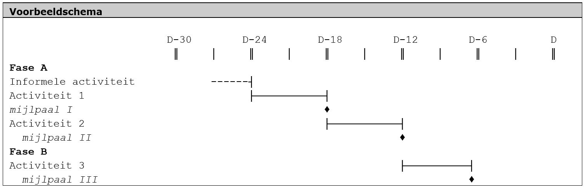

# Leeswijzer

**Voor u ligt het wijzigingsprotocol van de RO Standaarden. Hierin staan de
sturende principes achter het generieke wijzigingsproces van de RO Standaarden.
Met dit protocol wordt elke wijziging een voorspelbaar proces voor de
ketenpartners. Voor wie wanneer waarom en wat een wijziging is, dat beantwoordt
dit wijzigingsprotocol niet.**

Het wijzigingsprotocol beschrijft de manier waarop wijzigingen op de RO
Standaarden plaatsvinden. De RO Standaarden zijn bij wet vastgelegd met de
ministeriële ‘Regeling standaarden ruimtelijke ordening’. Wijziging in de
standaarden, van de aanpassing van een spreekwoordelijke komma tot een
aanvulling met een nieuwe standaard (doorontwikkeling), kunnen door de
verankering in de wet- en regelgeving en de vele type gebruikers niet zomaar
worden doorgevoerd. Een wijziging van de standaarden die voor de ene gebruiker
gering is, kan voor een ander grote consequenties hebben.

In dit document worden basisbegrippen en uitgangspunten uiteengezet om het
wijzigingsproces voor de RO Standaarden in hoofdlijnen te verklaren. Het
volledig wijzigingsproces doorloopt de fasen:

1.  Inhoud;

2.  Toetsing;

3.  Besluitvorming;

4.  Implementatie.

Dit proces kent vaste stappen die tijdgebonden zijn met een vaste datum van
inwerkingtreding van de nieuwe set RO Standaarden.

De vele actoren die betrokken zijn bij het wijzigingsproces van de RO
Standaarden worden in een apart hoofdstuk beschreven. Het hoofdstuk geeft de
belangrijkste taken en verantwoordelijkheden van de actoren aan. Iedere actor
bepaalt zelf of en in hoeverre hij/zij dit algemene wijzigingsprotocol uitwerkt
in een eigen protocol. Dat is geen taak van Geonovum.

De RO Standaarden zijn niet statisch, het protocol naar alle waarschijnlijkheid
ook niet. Wijziging van dit protocol zelf worden vermeld in het versiebeheer. De
meest actuele versie publiceert Geonovum op de website.

Door het hele document heen worden processen, activiteiten en mijlpalen
(producten) steeds weergegeven met eenvoudige opgemaakte proces schema’s. Steeds
is de activiteit of mijlpaal links in tekst aangegeven. De tijdsduur en planning
van de activiteit in maanden is aangegeven in relatie tot de datum van
inwerkingtreding (D) van de wijzigingen. D-6 betekent dus: 6 maanden voor de
inwerkingtredingdatum van een set wijzigingen. Stippellijntjes --- betekenen een
optionele of beperkte activiteit binnen een fase. Een ruit ♦ is een mijlpaal.

Een voorbeeld van zo’n schema is als volgt:

**Lijst met afkortingen**

| BC   | Business Case                                                                   |
|------|---------------------------------------------------------------------------------|
| BOR  | Beheeroverleg Ruimtelijkeplannen.nl van beheerorganisaties Kadaster en Geonovum |
| EC   | Europese Commissie                                                              |
| EU   | Europese Unie                                                                   |
| IPO  | Interprovinciaal Overleg                                                        |
| BZK  | Ministerie van Binnenlandse Zaken en Koninkrijksrelaties                        |
| MR   | Ministeriële Regeling                                                           |
| RO   | Ruimtelijke Ordening                                                            |
| SDRO | Stuur- en beheergroep Digitale Ruimtelijke Ordening                             |
| TRIP | Tripartite overleg van BZK, Kadaster, Geonovum                                  |
| VNG  | Vereniging van Nederlandse Gemeenten                                            |
| Wro  | Wet ruimtelijke ordening                                                        |
