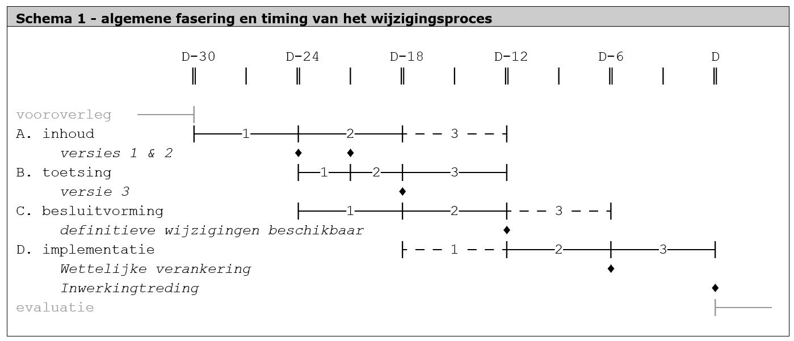
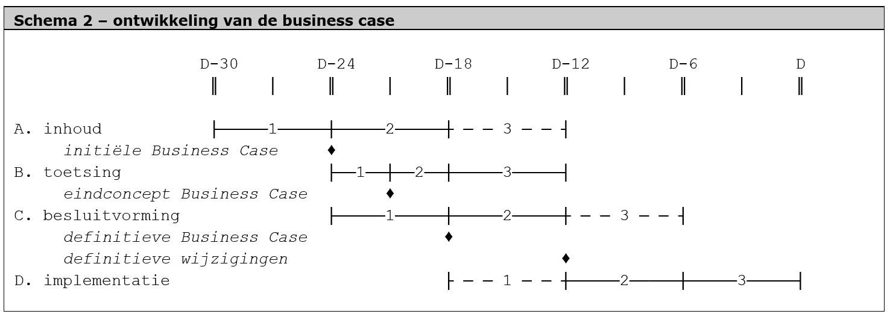

# Het primair wijzigingsproces

**Het wijzigingsprotocol ziet toe op een gecontroleerde manier van wijzigen van de
RO Standaarden. Een belangrijk onderdeel van dit protocol is het primaire proces
voor het doorvoeren van voorgestelde wijzigingen. Hierin is vastgelegd welke
fasering en mijlpalen er zijn en de timing van het wijzigingsproces. Dit
hoofdstuk beschrijft het primaire proces.**

## Hoofdlijnen van het wijzigingsproces

Schema 1 geeft de hoofdlijnen van het primaire proces weer: de algemene
hoofdfasen en de timing van deze fasen. Het begrip “versie” refereert aan de
versie van het wijzigingsvoorstel met business case.

Het primaire proces bestaat uit vier formele fasen en twee informele fasen die
respectievelijk voorafgaat aan de eerste fase en volgt op de vierde fase. Tabel
1 geeft deze fasen kort weer. Paragraaf 3.3 geeft voor iedere fase een meer
uitgebreide beschrijving.

| **Tabel 1 - Algemene fasering van het wijzigingsproces** |                                                   |
|----------------------------------------------------------|---------------------------------------------------|
| Vooroverleg                                              | informele afstemming                              |
| Fase A : inhoud                                          | wat wordt het voorstel?                           |
| Fase B : toetsing                                        | is het voorstel inhoudelijk en technisch correct? |
| Fase C : besluitvorming                                  | willen wij het definitief?                        |
| Fase D : implementatie                                   | doorvoeren in RO werkveld                         |
| Evaluatie                                                | informele nazorg                                  |

## Hoofdlijnen van het sturingsprincipe

Algemeen sturingsprincipe is dat voor elke wijziging een valide (positieve)
business case moet zijn. Deze business case ontwikkelt mee met de uitvoering van
het wijzigingsproces. Schema 2 geeft deze ontwikkeling weer. Bij iedere mijlpaal
moet er een positieve business case (BC) zijn voor iedere wijziging. De
Stuurgroep DRO beoordeelt of een business case positief is.

## Beschrijving van de fasen en resultaten

### Vooroverleg

Dit is een informele fase in het wijzigingsproces. Soms gaat er veel vooroverleg
vooraf aan het daadwerkelijk in gang zetten van een bepaalde wijziging. Bij het
ontwikkelen van een nieuwe standaard kan dit een proces van jaren zijn met
activiteiten als onderzoek, voorstudies en het zoeken van draagvlak.

*Resultaat*: duidelijk zicht op de scope, draagvlak en oplossingsrichting van de
beoogde wijzigingen.

### Fase A: Inhoud

In deze fase wordt het inhoudelijke wijzigingsvoorstel bepaald door de concrete
inhoud van elk wijzigingsverzoek uit te werken en de resultaten van uit het
vooroverleg te concretiseren: welke wijzigingen worden er precies voorgesteld?
Deze fases in onderverdeeld drie iteraties.

**Inhoud A1 - Eerste wijzigingsvoorstel met initiële Business Case**

*Fase A1:* In de eerste iteratie worden alle ingediende wijzigingsverzoeken uit
de voorgaande periode gebundeld en op hoofdlijnen uitgewerkt met voorgestelde
oplossing (of voorstel om niet mee te nemen).

*Resultaat A1:* Het eindproduct van deze iteratie is het eerste
wijzigingsvoorstel met initiële Business Case. Het is de eerste volledige
beschrijving van de voorgestelde wijzigingen, voldoende uitgewerkt voor
besluitneming en voor toetsing op juistheid in meer detail.

*Opmerkingen over A1*: Het eerste wijzigingsvoorstel wordt bekend gemaakt bij
alle actoren. Dit is het startpunt van fase C Besluitvorming.

**Inhoud A2 – Toetsen, aanpassen, besluiten**

*Fase A2:* In deze inhoudelijke iteratie wordt getoetst of het
wijzigingsvoorstel inhoudelijke juist is, of de wijzigingen in het voorstel
juist geformuleerd en uitvoerbaar zijn en of zij technisch haalbaar zijn voor
ieder actor.

*Resultaten A2:* de resultaten van deze iteratie zijn het resp. tweede en derde
wijzigingsvoorstel.

*Opmerkingen A2:* Gelijktijdig met deze inhoudelijke iteratie vindt
besluitvorming (fase C) plaats op basis van het eerste wijzigingsvoorstel.
Gekeken wordt of de wijzigingen in het voorstel wenselijk zijn en te prefereren
boven alternatieven. In deze iteratie kunnen in het voorstel wijzigingen
afvallen of veranderen als gevolg van de besluitvorming. Ook kunnen wijzigingen
technische verbeterd worden als gevolg van de toets.

**Inhoud A3 - Definitieve wijzigingen maken**

*Fase A3:* In deze laatste inhoudelijke iteratie implementeert het werkveld de
wijzigingen in de praktijk. Bij de implementatie kunnen nog technische
tekortkomingen worden ontdekt. In deze iteratie kunnen zij worden hersteld:
technisch foutherstel. Er worden geen nieuwe wijzigingen meer toegevoegd aan het
wijzigingsvoorstel.

*Resultaat A3:* Het eindproduct is het definitieve wijzigingsvoorstel.

*Opmerkingen A3:* Wie de definitieve wijzigingen voor het voorstel maakt en hoe
de koppeling met het werkveld plaats vindt wordt uitgewerkt in de volgende
hoofdstukken.

### Fase B: Toetsing

Deze fase vormt een brug tussen de inhoud, besluitvorming en implementatie.
Toetsen betekent het bepalen van de inhoudelijke correctheid en technische
haalbaarheid van de wijzigingen in het wijzigingsvoorstel. Er is een wezenlijk
verschil met besluitvorming. Bij het toetsen wordt de inhoudelijke *correctheid*
en technische haalbaarheid vastgesteld, bij besluitvorming de *wenselijkheid* om
de voorgestelde wijzigingen door te voeren. Deze fase is opgedeeld in drie
iteraties.

**Toetsing B1 - Initiële Business Case toetsen**

*Fase B1:* In de eerste iteratie toetsen de actoren inhoudelijk de eerste versie
van het wijzigingsvoorstel op volledigheid: zijn deze inderdaad de wijzigingen
die nodig zijn? Als het nodig is worden de formulering of details van het
wijzigingsvoorstel inhoudelijk aangepast of alternatieven geboden.

*Resultaat B1:* Het eindproduct van deze iteratie is de tweede versie van het
wijzigingsvoorstel met eindconcept Business Case. Dit voorstel moet inhoudelijk
compleet zijn en na oplevering klaar voor technische toetsing voor de
Definitieve Business Case.

*Opmerkingen B1:* Actoren mogen ervoor kiezen om in deze iteratie alvast
technische aspecten naar eigen belang te toetsen.

**Toetsing B2 - Eindconcept Business Case toetsen**

*Fase B2:* In deze tweede iteratie toetsen de actoren of de wijzigingen
technisch juist geformuleerd zijn, of zij haalbaar zijn (impact en kosten) en of
zij in een productieomgeving te implementeren zijn. In deze toets kunnen
wijzigingen pragmatisch aangepast worden.

*Resultaat B2:* Het eindproduct van deze iteratie is de definitieve Business
Case. Het is nu helder welke wijzigingen gewenst zijn en haalbaar worden geacht
en hoe zij juist geformuleerd moeten zijn.

**Toetsing B3 - Definitieve Business Case toetsen**

*Fase B3:* Dit is een technische iteratie. De verschillende actoren toetsen de
effecten van de wijzigingen onderling in gezamenlijke technische proefomgevingen
(testbeds). Ruimtelijkeplannen.nl maakt een versie waarmee softwareleveranciers
hun nieuwe versie van de RO applicatie kunnen toetsen en daarmee
Ruimtelijkeplannen.nl.

*Resultaat B3:* Het eindproduct van deze iteratie zijn de Definitieve
Wijzigingen. In principe is de Definitieve Business Case gelijk aan de
Definitieve Wijzigingen, tenzij er kleine technische kwesties aan het licht
komen.

*Opmerkingen B3:* Dit is ook de eerste iteratie van de fase Implementatie. Deze
iteratie is er alleen op gericht om kleine technische fouten die het werkveld
ontdekt bij de implementatie op gecontroleerde wijze te herstellen. Het is niet
de bedoeling dat er in deze iteratie pas serieus wordt gekeken naar de kwaliteit
van de wijzigingen in het voorstel.

### Fase C: Besluitvorming

Als er een eerste wijzigingsvoorstel met initiële Business Case ligt, vindt hier
formele besluitvorming over plaats. Hierbij hoort onder andere het wettelijke
traject dat doorlopen moet worden om de gewijzigde of nieuwe standaarden te
verankeren in de Wro wetgevingsfamilie en de inhoudelijk toetsing van de
wijzigingen. In bovenstaand schema is met een stippellijn de mogelijke uitloop
aangegeven. Dit geeft aan dat het volledige besluitvormingsproces langer duurt
bij de EU notificatieprocedure. In dat geval wordt de fase formeel afgerond met
de ontvangstbevestiging van de concept ministeriële regeling waarin de
wijzigingen zullen worden bekrachtigd. De fase besluitvorming is opgedeeld in
drie iteraties.

**Besluitvorming C1 - advies**

*Fase C1:* In deze iteratie vormen BOR en TRIP een advies over de wijzigingen in
het voorstel dat door Geonovum hen voorlegt. Dit is de eerste stap in de formele
besluitvorming.

*Resultaten C1:* Business Case voorzien van advies.

**Besluitvorming C2 - besluit**

*Fase C2:* In deze iteratie neemt het ministerie van BZK als
wetgever/beleidsmaker samen met andere leden van de Stuurgroep DRO een formeel
besluit over het advies van de TRIP.

*Resultaat C2:* Een formeel besluit door BZK.

**Besluitvorming C3 - verankering**

*Fase C3:* In deze iteratie vindt de optionele EU notificatieprocedure plaats.
Ook verzorgt BZK de wettelijke verankering.

*Resultaat C3:* Een (nieuwe) gepubliceerde ministeriële regeling waarmee de
nieuwe RO Standaarden verankerd zijn.

### Fase D: Implementatie

Nadat de besluitvorming over de voorgestelde wijzigingen wordt begonnen met de
implementatie. Software moet aangepast worden bij alle bronhouders en afnemers
van ruimtelijke plannen. Mogelijk moeten RO handboeken, de conformiteitstoets,
de Validator en/of Ruimtelijkeplannen.nl worden aangepast. Tijdens deze fase
wordt de implementatie begeleid waar nodig. Implementatie is opgedeeld in drie
iteraties.

**Implementatie D1**

*Fase D1:* In deze iteratie worden voornamelijk de Validator,
Ruimtelijkeplannen.nl en indien nodig de software voor de conformiteitstoetsing
aangepast. Dit is een beperkte iteratie, omdat het hier gaat om de implementatie
bij een beperkt aantal actoren. Naast het Kadaster en Geonovum als beheerders
van deze voorzieningen, betreft het mogelijk ook softwareleveranciers die
vroegtijdig de wijzigingen in hun software willen doorvoeren en toetsen. Het RO
werkveld in brede zin zal bij iteratie D2 de wijzigingen starten met de
implementatie van de wijzigingen.

*Resultaat D1*: een aangepaste Validator en een aangepaste Ruimtelijkeplannen.nl
ten behoeve van implementatie van bronhouders- en afnemerssoftware.

**Implementatie D2**

*Fase D2:* In deze iteratie worden Ruimtelijkeplannen.nl, bronhouders- en
afnemerssoftware ontwikkeld en worden conformiteitstoetsen afgenomen indien
nodig.

*Resultaat D1*: Software is klaar voor de uitrol bij bronhouders en afnemers,
bronhouders staan klaar om intern de implementatie uit te voeren voor de datum
inwerkingtreding.

**Implementatie D3**

*Fase D3:* In deze iteratie wordt software uitgeleverd, worden RO handboeken
aangepast en wordt dienstverlening op basis van de nieuwe RO Standaarden
voorbereid.

*Resultaat D3:* Het werkveld heeft de wijzigingen verwerkt en kan hiermee aan de
slag na de inwerkingtredingsdatum.

### Evaluatie

Na de inwerkingtreding van de wijzigingen zal het soms nodig zijn om de juiste
toepassing te monitoren en/of de effectiviteit te evalueren. Dit is afhankelijk
van de aard en omvang van de wijzigingen. Net als het vooroverleg is dit een
informele fase. Het resultaat hiervan is een helder beeld van de werking van de
ingevoerde wijzigingen en mogelijk zicht op noodzakelijke en/of gewenste
vervolgacties.

## Belangrijkste afhankelijkheden

De belangrijkste afhankelijkheden tussen de fases zijn weergegeven in
onderstaande tabel.

| **Tabel 2 - Afhankelijkheden tussen de fasen in het wijzigingsproces**                        |        |          |                |               |           |
|-----------------------------------------------------------------------------------------------|--------|----------|----------------|---------------|-----------|
| \- = weinig of geen afhankelijkheid \* = matige afhankelijkheid \*\* = sterke afhankelijkheid |        |          |                |               |           |
|                                                                                               | Inhoud | toetsing | besluitvorming | implementatie | evaluatie |
| vooroverleg                                                                                   | \*\*   | \-       | \*             | \-            | \-        |
| inhoud                                                                                        |        | \*\*     | \*\*           | \*            | \*        |
| toetsing                                                                                      |        |          | \*             | \*\*          | \*        |
| besluitvorming                                                                                |        |          |                | \*            | \*        |
| implementatie                                                                                 |        |          |                |               | \*\*      |

**Vooroverleg inhoud \*\***

In het vooroverleg wordt feitelijk gewerkt aan draagvlak voor de scope en
onderwerpen van de wijzigingen. Het heeft geen zin om inhoudelijk aan
wijzigingsverzoeken te werken als op voorhand duidelijk is dat dit in de
besluitvorming zal sneuvelen of dat slechts een beperkt deel van de voorgestelde
wijzigingen binnen de beschikbare budgetten kan worden uitgewerkt en
geïmplementeerd.

**Vooroverleg besluitvorming \***

In het vooroverleg vindt afstemming plaats over de scope en onderwerpen van de
wijzigen waar aan gewerkt zal worden. Daarmee wordt draagvlak vooraf gecreëerd.
Dit draagvlak is nodig voor de besluitvorming. Ook wordt de mate van
besluitvorming in kaart gebracht – hoe formeel en juridisch het traject wel of
niet moet zijn en de afhankelijkheden van of impact op andere wetten
(bijvoorbeeld de Grex of Wabo).

**Inhoud toetsing \*\***

Dit is een sterke afhankelijkheid. De inhoud wordt getoetst op correctheid
voorafgaand aan het proces van besluitvorming.

**Inhoud besluitvorming \*\***

Bij de besluitvorming is het met name van belang dat de voorgestelde wijzigingen
gewenst zijn. Daarom is tijdens het inhoudelijk bepalen van het
wijzigingsvoorstel afstemming nodig met TRIP en koepelorganisaties over punten
waar in de besluitvorming discussie over zou kunnen ontstaan. Te denken valt aan
het oplossen van een probleem dat op meerdere, verschillende manieren gedaan kan
worden. Dan is het goed om af te stemmen welke oplossing het meest gewenst is.

**Inhoud implementatie \***

De fase van implementatie is de lakmoesproef voor de vastgestelde wijzigingen.
Op dat moment moet blijken dat de wijzigingen realistisch en haalbaar zijn. Dit
betekent dat al tijdens de inhoudelijke fase goed gekeken moet worden of de
wijzigingsverzoeken hier aan voldoen.

**Inhoud evaluatie \***

In de evaluatie wordt teruggekeken hoe het hele proces verlopen is en hoe
bepaalde keuzes hebben uitgepakt in de praktijk. De conclusies kunnen input zijn
voor nieuwe inhoudelijke bijstellingen.

**Toetsing besluitvorming \***

Bij de besluitvorming moet een duidelijk beeld zijn van de kwaliteit van het
concreet uitgewerkte wijzigingsvoorstel. Ook de uitkomsten van eventuele
testbeds, die een indruk geven van de mate van realisme en haalbaarheid van de
voorgestelde wijzigingen, worden meegewogen in de besluitvorming.

**Toetsing implementatie \*\***

Er is een sterke afhankelijkheid tussen het toetsen van de voorgestelde
wijzigingen en het implementeren van de definitieve wijzigingen. Dit is cruciaal
voor het slagen van het gehele wijzigingsproces. Niet goed doordachte
wijzigingen zullen het werkveld in grote problemen brengen. Het werkveld moet
daarom goed betrokken zijn tijdens de fase van het toetsen van de wijzigingen
voordat deze definitief worden.

**Toetsing evaluatie \***

In de evaluatie wordt de wijze van toetsen bekeken. Dit kan tot nieuwe inzichten
leiden.

**Besluitvorming implementatie \***

In de besluitvorming is het wezenlijk in te schatten hoe haalbaar en realistisch
de voorgestelde wijzigingen zijn. De implementatie is hiermee afhankelijk van
een gedegen besluitvorming. Om te kunnen monitoren hoe hun besluiten in de
praktijk uitpakken is het van belang dat degene die betrokkenen zijn bij de
besluitvorming de implementatie volgen.

**Besluitvorming evaluatie \***

In de evaluatie wordt de besluitvormingsprocedure bekeken. Dit kan tot nieuwe
inzichten leiden.

**Implementatie evaluatie \*\***

De relatie tussen de evaluatie en de implementatie is het belangrijkst.
Uiteindelijk is de hamvraag in de evaluatie: kan het beroepspraktijk er mee
werken?
