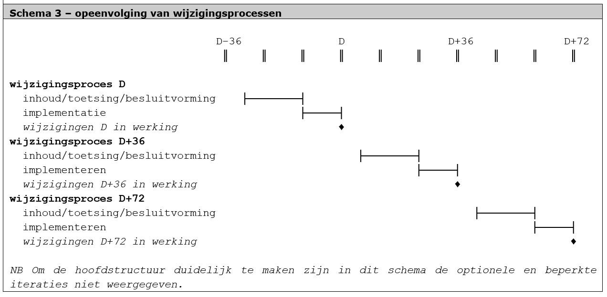

# De systematiek van opeenvolgende wijzigingen

**Voor de ontwikkelingen in de ruimtelijke ordening en als gevolg van externe
ontwikkelingen zullen de RO standaarden naar verwachting de komende jaren steeds
in beweging blijven. Enerzijds is er foutherstel en het aanbrengen van kleine
gewenste verbeteringen. Dit zal steeds tot kleine aanpassingen leiden.
Anderzijds zijn er ook nieuwe ontwikkelingen te verwachten voor de komende
jaren. Dit alles maakt dat het wijzigingsproces steeds opnieuw zal worden
uitgevoerd. In dit hoofdstuk wordt deze systematiek toegelicht.**

Het werkveld vraagt om een wijzigingsregime van één samenhangende set
wijzigingen per drie jaar. Omdat het gehele wijzigingsproces een doorlooptijd
kent van in principe tweeënhalf jaar, zullen verschillende processen elkaar
opvolgen, met slechts een korte periode na inwerkingtreding waarin er eigenlijk
niets gebeurt. Dit is weergegeven in Schema 3:

Doordat de processen elkaar precies opvolgen, kan een set wijzigingen
gecontroleerd worden doorgevoerd, terwijl er voldoende dynamiek overblijft voor
updates.
