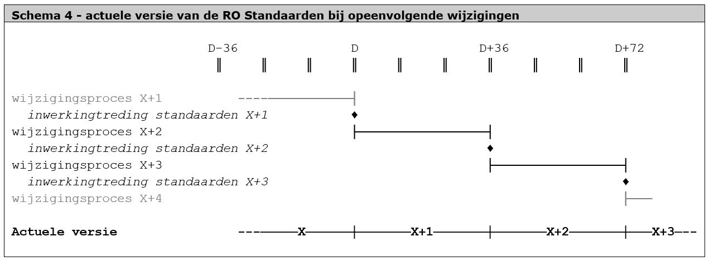

Uitgangspunten
==============

**Het wijzigingsprotocol gaat uit van een aantal uitgangspunten dat een vaste
set randvoorwaarden vormt bij het doorvoeren van wijzigingen op de RO
Standaarden. In dit hoofdstuk wordt nader ingegaan op deze uitgangspunten.**

De uitgangspunten worden gegeven in Tabel 3 en hieronder verder uitgewerkt.

| **Tabel 3 - uitgangspunten bij het wijzigingsproces**        |
|--------------------------------------------------------------|
| Business Case is leidend                                     |
| Altijd één geldige versie van de RO Standaarden              |
| Start van de formele procedure is leidend bij versiebepaling |
| Eén maal per drie jaar wijzigingen doorvoeren                |
| Vaste datum inwerkingtreding                                 |
| Geen wijzigingsplicht voor eenmaal gepubliceerde plannen     |
| Aanpassing van vorm- of technische aspecten van een gepubliceerd plan |

Business Case is leidend
------------------------

Het proces van een initieel idee tot de inwerkingtreding van een wijziging is
een langdurig proces. Tijdens het proces verschuift de focus van idee naar
inhoud naar aanpassingen naar besluitvorming naar systemen en werkprocessen en
naar wetgeving. Als uitgangspunt wordt een business case (BC) opgesteld als
rationalisatie voor het wel of niet doorvoeren van voorgestelde wijzigingen. In
dit document is vastgelegd wat de toegevoegde waarde is van de wijzigingen.
Daarbij wordt per wijziging beschreven waarom bepaalde keuzes zijn gemaakt,
welke voordelen de wijziging biedt, wat de baten en kosten van de wijziging zijn
-zowel kwalitatief als kwantitatief- en welke aannames hierbij zijn gehanteerd.

Een BC bevat liefst een goede investeringsanalyse en een risicoanalyse. Zij
wordt vooraf goedgekeurd door de stuurgroep en bij ieder beslismoment opnieuw
aangepast en beoordeeld op geldigheid (zie Schema 2). Na afronding van het
wijzigingsproces vindt de evaluatie plaats op basis van de uitgangspunten die
zijn vastgelegd in de BC.

Altijd één geldige versie van de RO Standaarden
-----------------------------------------------

Op ieder moment in de tijd is er slechts één versie van de RO Standaarden
actueel. Tot aan de inwerkingtreding van een set wijzigingen op tijdstip D is de
actuele versie de versie zonder de wijzigingen (X), vanaf tijdstip D zijn de RO
Standaarden waarop de wijzigingen zijn doorgevoerd (X+1) actueel. In Schema 1 is
de actuele versie weergegeven bij opeenvolgende wijzigingen.

In dit schema is weergegeven dat een nieuwe versie van de RO Standaarden actueel
wordt op het moment van inwerkingtreding. Dit betekent een aantal dingen, te
weten:

het gebruiken van de nieuwe standaarden *voor* de inwerkingtreding is niet
toegestaan. Uitzondering zou kunnen zijn bij het opstellen van een nieuw plan
dat naar verwachting de formele Wro procedure ingaat op het moment dat de nieuwe
standaard actueel is;

het gebruiken van de nieuwe standaarden *na* de inwerkingtreding is verplicht;

het gebruiken van de oude standaarden *na* de inwerkingtreding is alleen
toegestaan bij lopende procedures (zie paragraaf 5.3 en 5.6).

Start van de formele procedure is leidend bij versiebepaling
------------------------------------------------------------

Het bepalen welke versie van de RO Standaarden er gebruikt moet worden is
eenvoudig te beantwoorden. Er wordt namelijk altijd gewerkt met de actuele
versie van de standaarden op het moment dat de formele Wro procedure van start
gaat. Bij het bestemmingsplan is dit het moment waarop het ontwerp ter inzage
wordt gelegd (Wro artikel 3.8 eerste lid), bij veel andere instrumenten is dit
gelijk aan het moment van vaststelling.

De procedure wordt afgemaakt -tot het moment dat het instrument onherroepelijk
wordt- met dezelfde versie van de RO Standaarden die actueel was bij de start
van de procedure. In de praktijk heeft dit wel tot gevolg dat er dus soms van
standaard moet worden "gewisseld" voor aanvang van de formele procedure. Dat kan
lastig zijn in individuele gevallen en vergt voldoende aandacht van de
bronhouder om bijvoorbeeld tijdig software updates door te voeren.

Eén maal per drie jaar wijzigingen doorvoeren
---------------------------------------------

In maart 2018 is in samenspraak met BZK besloten om de RO Standaarden 2012 niet
meer te wijzigen en deze RO Standaarden 2012 te blijven gebruiken in aanloop
naar en in verband met overgangsrecht onder de Omgevingswet. Zonder een business
case te hebben gemaakt, is geconcludeerd dat op basis van de relevante
wijzigingsverzoeken die de afgelopen jaren zijn gedaan, dat de kosten van een
wijzigingsproces nu niet opwegen tegen de baten.

Vaste datum inwerkingtreding
----------------------------

Binnen een driejaarlijkse cyclus van wijzigingen zal er gewerkt worden met een
vaste datum inwerkingtreding, te weten **1 januari**. Dit uitgangspunt geeft
voorspelbaarheid bij het werkveld. Het is op die manier ver van tevoren
duidelijk wanneer er bepaalde inspanningen geleverd moeten worden.

Geen wijzigingsplicht voor eenmaal gepubliceerde plannen
--------------------------------------------------------

Een planprocedure wordt gestart en doorlopen met één versie van de RO
Standaarden. Het starten van de formele procedure is daarmee het uitgangspunt,
bijvoorbeeld bij bestemmingsplannen is dit de datum waarop het ontwerp ter
inzage is gelegd. Het wijzigen van de RO Standaarden zal dus nooit effect hebben
op plannen die in procedure zijn. Maar ook plannen die onherroepelijk zijn
geworden ondervinden geen effecten van het doorvoeren van toekomstige
wijzigingen op de RO Standaarden, juist vanwege de betekenis van de term
onherroepelijk. Dit alles kan worden samengevat in het uitgangspunt dat eenmaal
gepubliceerde informatie nooit gewijzigd hoeft te worden ten gevolge van het
doorvoeren van wijzigingen in de RO Standaarden.

Aanpassing van vorm- of technische aspecten van een gepubliceerd plan
---------------------------------------------------------------------

Ambtelijk foutherstel in een ruimtelijke plan of besluit door de bronhouder is
mogelijk zonder voorafgaand besluit. Dit valt onder het herstellen van de
metadata c.q. de technische kenmerken van het ruimtelijk plan of besluit of het
opheffen van inconsistenties in de planvoorraad tussen bronhouder en
Ruimtelijkeplannen.nl. Dit is vastgelegd in de werkafspraak ‘Wijzigen reeds
eerder gepubliceerde plannen’[^1].

[^1]: Zie ook Werkafspraak [Wijzigen reeds eerder gepubliceerde
plannen](https://www.geonovum.nl/uploads/documents/201809%20ROST%20wa%20wijzigen%20vastgestelde%20versie%20def.pdf)
en de [Handreiking “Data op
orde”](https://www.geonovum.nl/uploads/documents/20180925%20Handreiking%20Data%20op%20Orde%20-%20versie%20%201.1_0.pdf)

De hoofdregel is dat foutherstel niet gaat over de inhoud van een plan of
besluit, maar om vorm- of technische aspecten die van belang zijn voor blijvende
raadpleegbaarheid, bruikbaarheid en toegankelijkheid van het plan. Bij gebreken
aan de inhoud van het plan of besluit zal het bevoegd gezag een nieuw besluit
moeten nemen of een nieuwe procedure moeten volgen.
