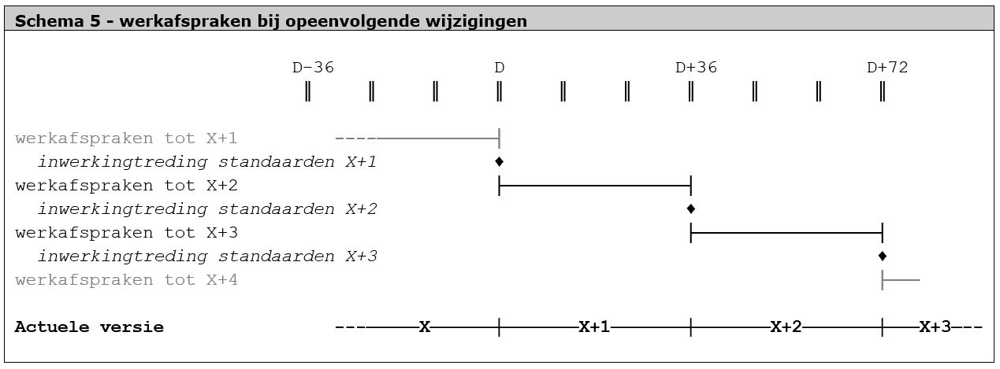

Tussentijdse werkafspraken
==========================

**Het toepassen van de RO Standaarden roept soms vragen op. Bij
onduidelijkheden, discrepanties of fouten in de RO Standaarden kan de RO
praktijk vragen hoe zij de Standaarden – in afwachting van een formele
wijziging– moet toepassen. Omdat er wordt gewerkt in een driejaarlijkse
wijzigingscyclus, zullen geconstateerde fouten of gewenste wijzigingen in de
regel niet heel snel worden doorgevoerd in de formele RO Standaarden. Een
tussentijds gebruiksadvies noemen we een werkafspraak. In dit hoofdstuk lichten
we de werkwijze van werkafspraken toe.**

Als er een fout of probleem wordt geconstateerd, zal er altijd geruime tijd
overheen gaan voordat dit wordt hersteld in de formele standaard. Typische
voorbeelden van dit soort fouten zijn in algemene zin:

-   de ene standaard hanteert voor een bepaalde aanduiding een andere spelling
    dan een andere standaard, waardoor je plan formeel nooit aan alle
    standaarden kan voldoen;

-   in de standaarden zijn bepaalde technische vrijheden mogelijk die op grond
    van een goede RO praktijk niet zouden moeten worden benut;

-   in de standaarden is iets wel mogelijk, maar niet verplicht, terwijl dit wel
    sterk gewenst is.

In dit soort gevallen zal Geonovum na consultatie van softwareleveranciers, BOR
en TRIP een werkafspraak publiceren over hoe er in afwachting van formele
reparatie moet worden omgegaan met een geconstateerd probleem. Zo’n werkafspraak
heeft de formele status van een *advies* van Geonovum aan het RO werkveld. De
werkafspraak kan nooit de wettelijk verankerde RO Standaarden vervangen, omdat
de Wro geen mogelijkheden biedt om bevoegdheden tot het vaststellen van
technische regels over te dragen aan de beherende instantie. Echter, het beheer
van de RO Standaarden wordt uitgevoerd in opdracht van BZK, en BZK beschouwt het
maken van werkafspraken met het RO werkveld in afwachting van reparatie als een
onderdeel van het reguliere beheer.

Voor bovengenoemde voorbeelden zouden de werkafspraken er resp. als volgt uit
kunnen zien:

-   hanteer altijd de spelling volgens standaard X;

-   gebruik nooit de mogelijkheid Y die de standaarden bieden;

-   doe het altijd op manier Z.

In Schema 5 is weergegeven in welke periode er werkafspraken gelden in
afwachting van de volgende versie van de RO Standaarden.

In dit schema is weergegeven dat er voorafgaand aan de inwerkingtreding van een
set met wijzigingen werkafspraken worden gemaakt die vooruitlopen op de
aanstaande wijzigingen.

De status van deze werkafspraken is als volgt:

1.  de werkafspraken zijn van toepassing totdat de wijzigingen in werking zijn
    getreden, daarna zijn ze niet meer van toepassing;

2.  indien mogelijk zijn de werkafspraken altijd een directe voorloper van de
    wijzigingen zelf die zullen worden doorgevoerd. Vaak zal een werkafspraak
    een keuze bevatten. Deze zal goed beredeneerd zijn, maar toch anders kunnen
    uitvallen als het daadwerkelijke wijzigingsproces wordt ingezet;

3.  binnen het wijzigingsbeheer worden er alleen werkafspraken gemaakt die
    vooruitlopen op aanstaande wijzigingen. Er worden binnen dit kader geen
    permanente werkafspraken gemaakt die niet verankerd zullen worden in de RO
    Standaarden;

4.  het toepassen van de werkafspraken is van rechtswege niet verplicht, maar
    met name de leveranciers van RO Software hebben aan Geonovum aangegeven hier
    behoefte aan te hebben;

5.  het toepassen van de werkafspraken vergemakkelijkt de implementatie van
    wijzigingen, omdat het een al een voorbereidende werkwijze is voor het
    ander;

6.  waar van toepassing zullen de werkafspraken niet leiden tot afkeuring van
    plannen die hier niet aan voldoen door de Validator. Eventueel kan wel een
    waarschuwing of andersoortige melding worden gegeven over de geconstateerde
    afwijking van de werkafspraak.
