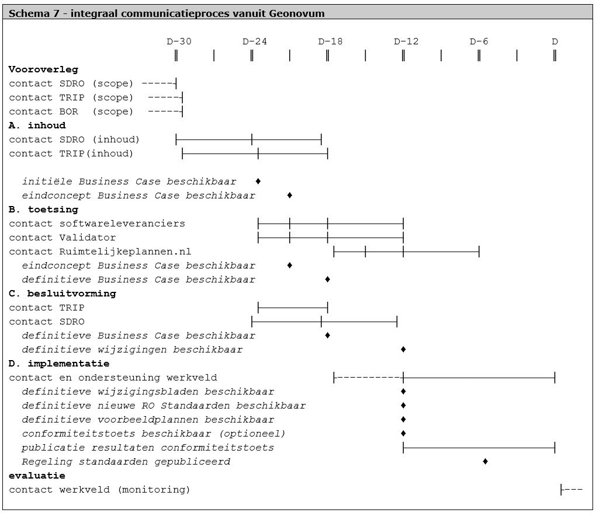

# Communicatie

**Het hele wijzigingsproces staat of valt met een goede communicatie. Onder goede
communicatie wordt verstaan het tijdig leveren van de juiste informatie aan de
juiste belanghebbenden. In dit hoofdstuk wordt de integrale communicatie als
apart proces beschreven. Er wordt ingegaan op zowel de proceskant alsook de
producten die er worden gehanteerd.**

## Communicatieproces

In het onderstaande schema worden de procesmatige aspecten van de integrale
communicatie omtrent de RO Standaarden gegeven. Schema 7 geeft aan wat er in
welke fase verwacht kan worden.

## Communicatieproducten

De volgende producten spelen een rol binnen het communicatieproces.

**Business Case**

De Business Case beschrijft de rechtvaardiging voor het opzetten en continueren
van de wijzigingen. Geeft de redenen voor de wijzigingen; beantwoord het
‘waarom’ en bevat een overzicht van te verwachte kosten en baten. De Business
Case wordt aangepast aan de actualiteit op belangrijke momenten in het proces.

**Initiële Business Case**

De eerste versie van de Business Case is samengevoegd met de eerste versie van
het wijzigingsvoorstel. Voor ieder wijziging is een indicatie van de redenering
waarom de wijziging nodig geacht is en wat de impact zou zijn op welke
ketenpartners. Een overzicht (samenvatting) van het geheel maakt onderdeel uit
van het set documenten. In dit document is “eerste versie wijzigingsvoorstel”
nagenoeg uitwisselbaar met de “initiële Business Case” vanwege de samenhangende
presentatie van de informatie.

**Eerste versie wijzigingsvoorstel: Initiële Business Case**

Het eerste concept wijzigingsvoorstel is de eerste versie van gebundelde
wijzigingsverzoeken met bij ieder wijzigingsverzoek de Business Case informatie.
Het is het eerste product dat tijdens de inhoudelijke fase wordt gepubliceerd.
Dit voorstel is niet per sé een volledig uitgewerkte set wijzigingsverzoeken,
maar het is een middel om bij software leveranciers, stedenbouwkundige bureaus,
Ruimtelijkeplannen.nl en de Validator te kunnen toetsen of de oplossingsrichting
en keuzes worden gedragen. Het wordt opgeleverd omstreeks halverwege de
inhoudelijke fase en vormt het startpunt voor de toetsingsfase.

**Tweede versie wijzigingsvoorstel: Eindconcept Business Case**

Het tweede versie wijzigingsvoorstel, oftewel Eindconcept Business Case, is een
tussenproduct in de toetsingsfase, en is de laatste inhoudelijke fase voor het
definitieve Business Case. Dit product is een uitwerking van de eerste versie en
is aangevuld/gecorrigeerd naar aanleiding van feedback op de Initiële Business
Case en ervaringen binnen de RO keten. Doel van dit product is het voorleggen
voor formeel advies bij TRIP en de stuurgroep DRO. Binnen het
besluitvormingsproces door de Stuurgroep DRO kunnen er nog wijzigingen
aangebracht worden in deze versie. Ook zou het kunnen voorkomen dat er slechts
over een deel van het wijzigingsvoorstel een positief advies wordt gegeven.

**Derde versie wijzigingsvoorstel: Definitieve Business Case**

De derde versie wijzigingsvoorstel is een eindproduct van de technische tests op
de voorgestelde wijzigingen en bijbehorende oplossingen, en is de laatste
inhoudelijke fase voordat de keuze van wijzigingen definitief wordt. Deze versie
is een “kandidaat” voor de definitieve wijzigingen, waar het werkveld mee aan de
slag gaat. De principe keuzes zijn gemaakt dus is dit de Definitieve Business
Case. Indien er geen fouten meer in deze versie gevonden worden, zal dit derde
wijzigingsvoorstel de definitieve versie worden.

**Werkafspraken**

De werkafspraken die bepalen hoe er in de tussentijd moet worden omgegaan met
geconstateerde fouten en problemen (zie Hoofdstuk 6). De werkafspraken
publiceren wij via de Geonovum website, onderdeel RO Standaarden. Door middel
van nieuwsberichten op de website en het versturen van de nieuwsbrief Wro
Digitaal informeren wij het werkveld over de nieuwe dan wel aangepaste
werkafspraak.

**Praktijkrichtlijnen**

Het jaarlijks actualiseren van de toelichting op de bij ministeriële regeling
verankerde normdocumenten (zie Hoofdstuk 7).

**Testdata**

Samen met het opleveren van de Definitieve Business Case wordt er ook relevante
testdata geleverd aan het werkveld voor wie daar mee aan de slag wil.
Definitieve Business Case (derde versie wijzigingsvoorstel) en testdata horen
dus bij elkaar. In principe gaat het om technische testdata. Dit is dus iets
anders dan de voorbeeldplannen die worden gemaakt (zie hier onder).

**Vastgestelde wijzigingen: definitieve wijzigingen**

Na positief advies van TRIP, een formeel besluit van BZK en de Stuurgroep DRO en
het afronden van de laatste toetsingsiteratie ten behoeve van foutcorrectie zijn
de wijzigingen vastgesteld. De vastgestelde wijzigingen zijn de inhoudelijk
definitieve versie en vormen het eindpunt van de besluitvorming en toetsing.

**Wijzigingsdocumenten**

Met het beschikbaar komen van de vastgestelde definitieve wijzigingen worden
door Geonovum zogenoemde wijzigingsdocumenten beschikbaar gesteld. Hierin zijn
de wijzigingen zichtbaar en voor een ieder inzichtelijk.

**Nieuwe RO Standaarden**

Met het beschikbaar komen van de vastgestelde wijzigingen worden door Geonovum
ook beschikbaar gesteld een integrale set nieuwe RO Standaarden.

**oorbeeldplannen**

Samen met de vastgestelde wijzigingen worden soms ook voorbeeldplannen geleverd
aan het werkveld voor wie daar mee aan de slag wil. Dit is echter afhankelijk
van de wijziging van de verschillende normen van de standaarden. Niet voor alle
plannen kunnen voorbeeldplannen worden aangedragen. Het gaat hier om
realistische voorbeelden, die wellicht een aanpassing zullen zijn van de reeds
bestaande set voorbeelden of van (aangepaste) bestaande plannen uit de praktijk.
Dit is dus iets anders dan de technische testdata, die al in een eerder stadium
beschikbaar zullen komen (zie hier boven).

**Ministeriële Regeling**

De vastgestelde wijzigingen zullen door BZK wettelijk worden verankerd in een
ministeriële regeling. In principe is dit een regeling die wordt vastgesteld
door de minister van BZK. In voorkomende gevallen, bij structurele uitbreidingen
van de RO Standaarden zal de concept MR ter notificatie aangeboden moeten worden
aan de lidstaten van de EU en de Europese Commissie (EC). In theorie kan een
lidstaat of de EC dan nog bezwaar aantekenen, waardoor er toch nog wijzigingen
noodzakelijk zouden zijn op de vastgestelde versie. Maar gezien eerdere ervaring
met het geheel nieuwe pakket RO Standaarden 2008 (dat deze notificatieprocedure
daadwerkelijk doorlopen heeft) en de grondslagen waarop bezwaar gemaakt zou
kunnen worden, is deze exceptionele situatie niet gemodelleerd in het
wijzigingsproces.

**Resultaten conformiteitstoets**

Bij substantiële wijzigingen zal Geonovum beoordelen dat Wro software geheel of
gedeeltelijk opnieuw gecertificeerd moet worden. In dat geval worden de
resultaten na afname van de conformiteitstoets bekend gemaakt als leveranciers
deze conformiteitstoets positief hebben afgelegd. Daarmee vormen ze een
communicatieproduct binnen het wijzigingsproces.

**Besprekingsverslagen overleg softwareleveranciers**

Geonovum organiseert een regelmatig overleg met de softwareleveranciers. In dit
overleg worden de leveranciers tijdig geïnformeerd over aanstaande wijzigingen
en wordt ook gevraagd om input aangaande voorgestelde wijzigingen. Van het
overleg wordt een verslag gemaakt.
